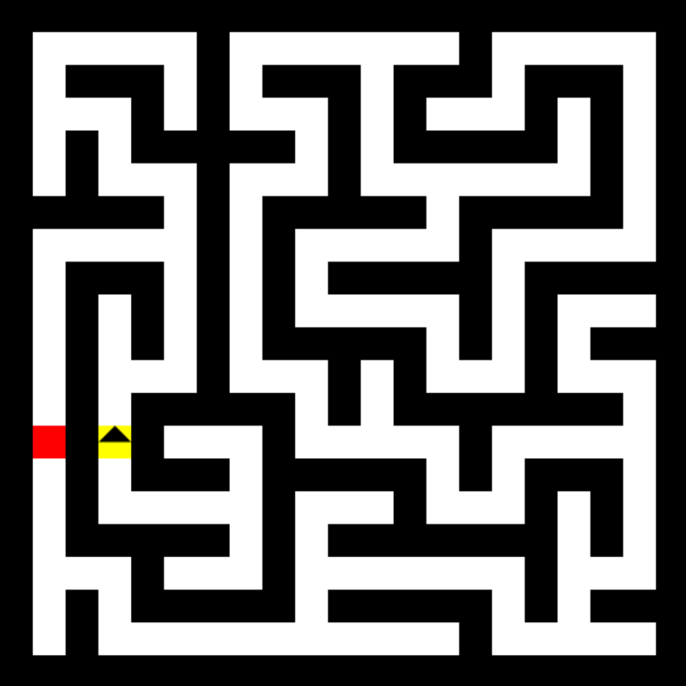
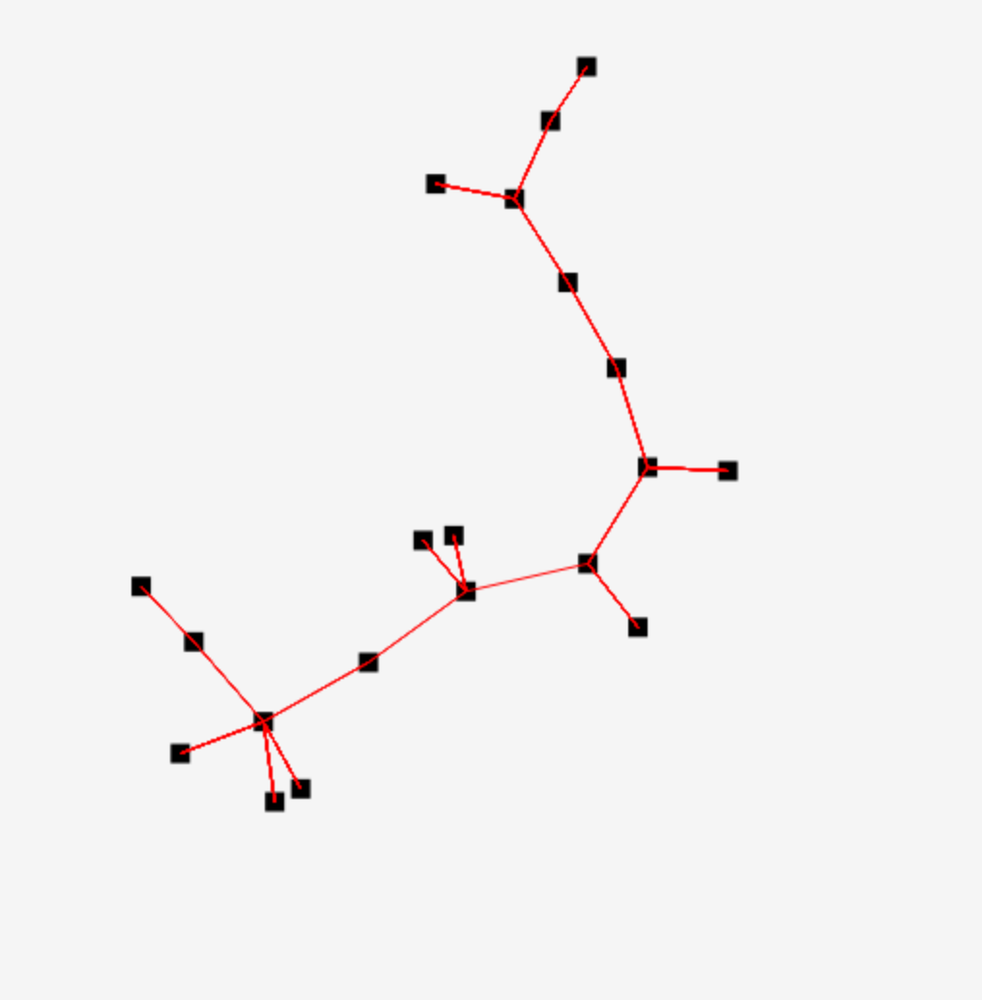
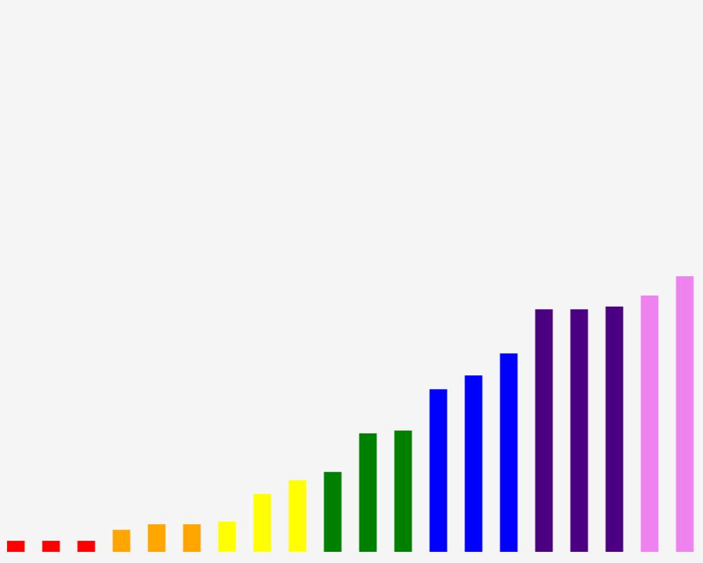
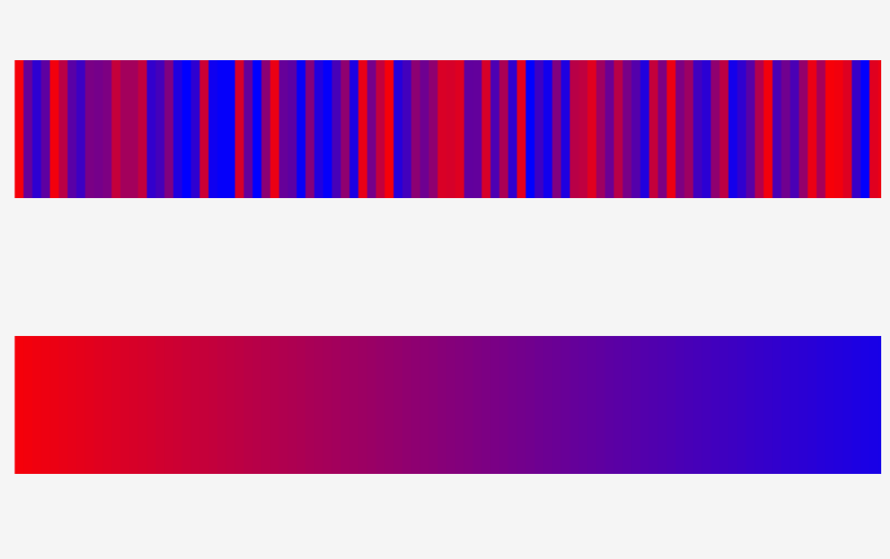
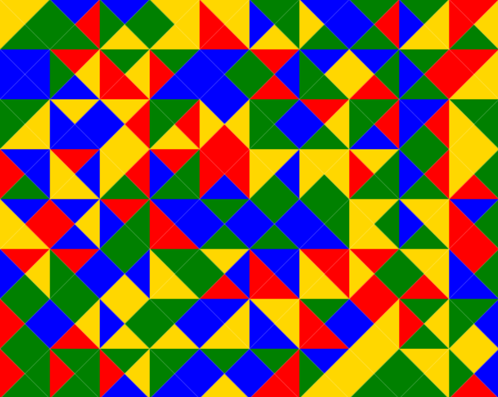

Below you will find some information on how to perform common tasks. 

# JSExperiments

JsExperiments is a web app featuring a fully in-browser JavaScript editor with visual feedback. It is intended as a learning tool, providing an interface for users to <b>see</b> the results of their code. You can find it deployed [here](https://dev.d3513lez266dga.amplifyapp.com/). 

## Table of Contents
- [Experiments](#experiments)
  - [Maze Navigation](#maze-navigation)
  - [Graph Visualization](#graph-visualization)
  - [List Sorting](#list-sorting)
  - [Rod Heating](#rod-heating)
  - [Color Puzzle](#color-puzzle)

## Experiments

### Maze Navigation

<ul>
<li> simply connected mazes </li>
<li> demo using right-hand rule </li>
</ul>

### Graph Visualization

<ul>
<li> random trees </li>
<li> demo using force-directed algorithm </li>
</ul>

### List Sorting

<ul>
<li> Sort 20 item list</li>
<li> demo using selection sort</li>
</ul>

### Rod Heating

<ul>
<li> numerically solve heat equation</li>
<li> demo using Gauss-Seidel algorithm</li>
</ul>

### Color Puzzle

<ul>
<li> match edge colors</li>
<li> demo using simulated annealing </li>
</ul>

This project was bootstrapped with [Create React App](https://github.com/facebookincubator/create-react-app).

